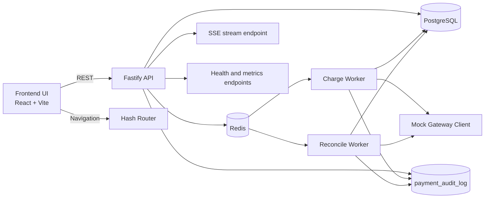
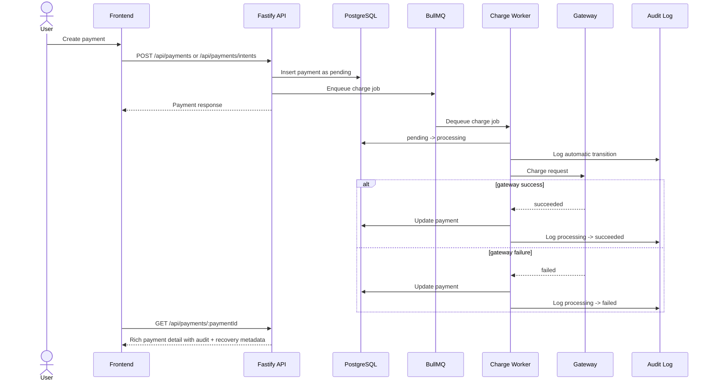
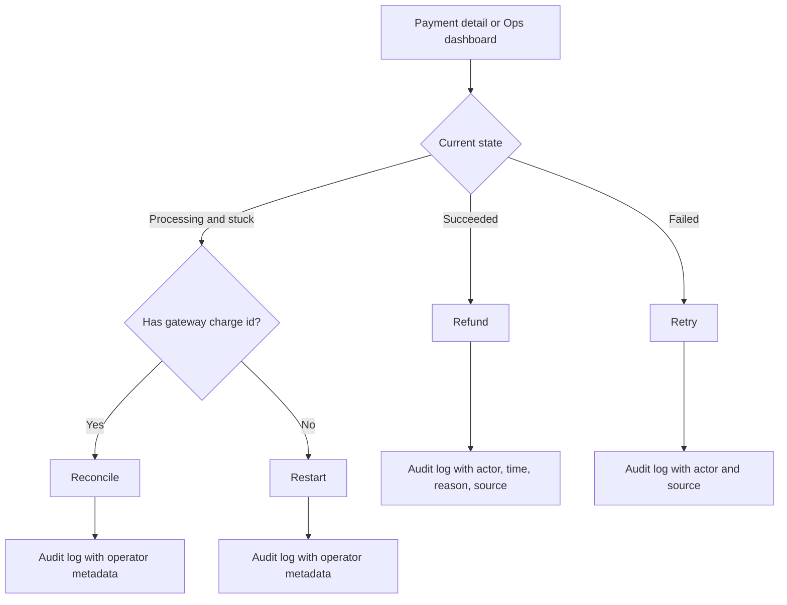
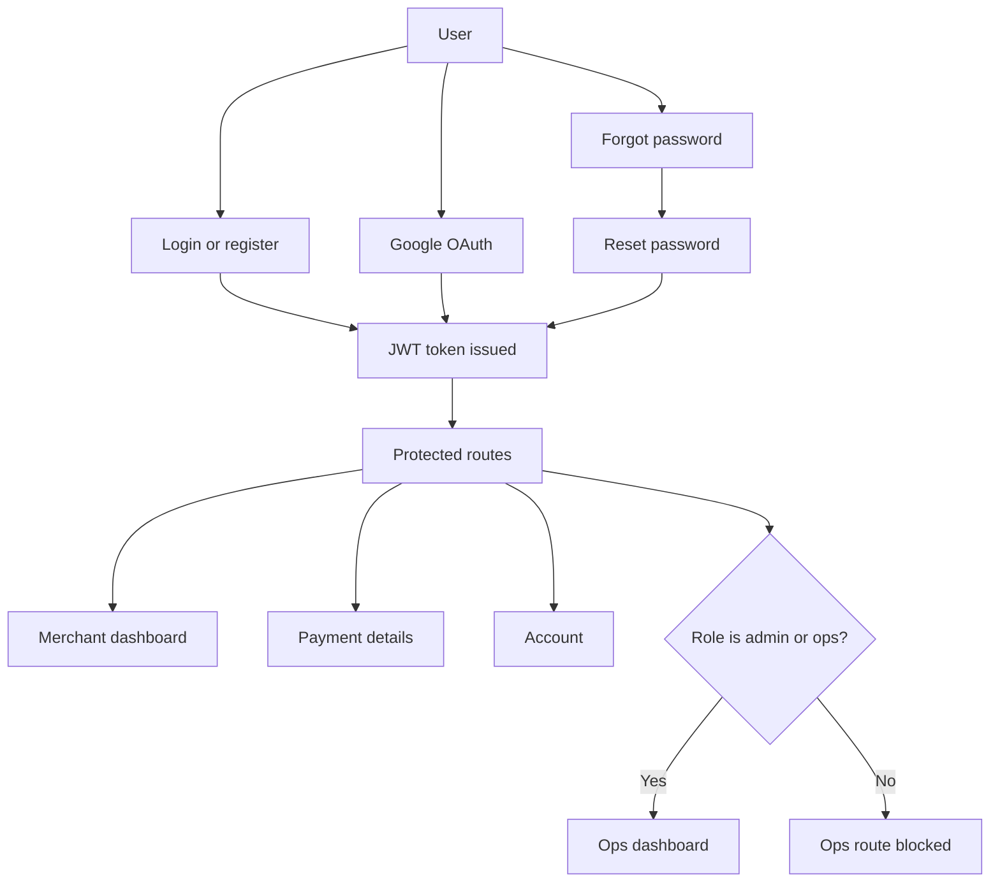

# Payeazie

Payeazie is a full-stack payment operations application built around a simple but realistic payment lifecycle: create a payment, process it asynchronously, reconcile long-running states, expose audit history, and give internal operators a controlled way to intervene when something goes wrong.

The current repository sits between a prototype and a productized internal tool. It has enough operational behavior to model real payment workflows, while still using a mock gateway and local-first infrastructure so the system is easy to run, inspect, and extend.


## What The Project Covers

- Merchant-facing payment creation and tracking
- Asynchronous charge processing through Redis and BullMQ workers
- State-machine-based payment transitions with audit logging
- Refunds with eligibility rules and operator attribution
- Retry and stuck-payment recovery actions with backend guardrails
- Internal ops dashboard for all-payments visibility and manual actions
- Internal gateway/webhook simulator for controlled status changes
- JWT auth, Google OAuth, forgot-password, and reset-password flows
- Health and metrics endpoints for basic operational visibility

## Repository Layout

```text
.
├── backend/         Fastify API, workers, PostgreSQL access, auth, audit, queues
├── frontend/        React + Vite UI for merchant and internal operator workflows
└── README.md        Root project guide
```

There is no root-level one-command orchestrator today. The backend and frontend are run separately.

## Tech Stack

### Backend

- Node.js
- Fastify
- PostgreSQL via `pg-promise`
- Redis
- BullMQ
- JWT authentication
- Google OAuth 2.0
- Nodemailer for password reset email delivery
- Vitest for tests

### Frontend

- React 19
- TypeScript
- Vite
- React Router
- Recharts
- Vitest + Testing Library

## Current Architecture



## Architectural Patterns In Use

### 1. API + worker split

Payment creation returns quickly after persistence and queueing. Gateway interaction happens in background workers rather than inside the request-response path.

### 2. Explicit status lifecycle

Payment states are centralized in the backend and validated through a shared transition model rather than being treated as free-form strings.

### 3. Audit-first transitions

Status changes are not just updates to the `payments` table. They are paired with audit records that capture actor, source, metadata, and timestamps.

### 4. Recovery as a first-class concern

Retry, reconcile, restart, refund, and simulated gateway updates are treated as explicit operational actions with backend guardrails, not ad hoc UI buttons.

### 5. Role-aware internal surfaces

Merchants primarily see their own payments. Internal operators with `admin` or `ops` roles can access all payments and internal recovery tools.

### 6. Local-first infrastructure

The stack assumes PostgreSQL and Redis are available locally. The gateway is mocked by default, which keeps the project runnable without third-party payment credentials.


## End-To-End Payment Flow



## Status Model

The backend lifecycle lives in `backend/src/utils/payment-status.js` and is the source of truth for finality, retryability, refundability, and transition validity.

### Supported statuses

| Status | Meaning |
| --- | --- |
| `pending` | Payment exists and is ready to be worked |
| `processing` | Worker has picked it up or the gateway state is in flight |
| `succeeded` | Charge completed successfully |
| `failed` | Charge failed or the payment was returned to a failed outcome |
| `refunded` | A previously successful payment was refunded |

### Allowed transitions

| From | To |
| --- | --- |
| `pending` | `processing`, `failed` |
| `processing` | `pending`, `succeeded`, `failed` |
| `succeeded` | `refunded` |
| `failed` | `pending` |
| `refunded` | none |

### Final states

- `succeeded`
- `failed`
- `refunded`

### Operational guardrails currently enforced

- Refund is only allowed from `succeeded`
- Retry is only allowed from `failed`
- Refunded payments cannot transition further
- Reconcile and restart are aimed at stuck `processing` payments
- Internal simulator actions are restricted to internal roles

## Manual Actions And Recovery Model

The application now treats operations support as part of the normal flow, not as an afterthought.

| Action | Intended use | Current backend rule |
| --- | --- | --- |
| Refund | Reverse a completed charge | Only `succeeded` payments, reason required |
| Retry | Reprocess a failed payment | Only `failed` payments, with retry guardrails |
| Reconcile | Check a long-running processing payment against gateway state | Used for stuck `processing` records with gateway context |
| Restart | Move a stuck processing payment back into the queue path | Used for stuck `processing` records that need to be requeued |
| Simulate gateway status | Trigger controlled internal state changes | Internal-only, valid next statuses only |


## Payment Recovery Flow



## Backend Design

### API surface

The backend runs as a Fastify server and registers payment, auth, and audit routes under `/api` or `/api/auth`.

#### Health and metrics

- `GET /`
- `GET /health`
- `GET /health/detailed`
- `GET /metrics`
- `GET /metrics/summary`

#### Auth endpoints

- `POST /api/auth/register`
- `POST /api/auth/login`
- `GET /api/auth/me`
- `POST /api/auth/forgot-password`
- `POST /api/auth/reset-password`
- `GET /api/auth/google`
- `GET /api/auth/google/callback`

#### Payment endpoints

- `GET /api/payments`
- `GET /api/payments/:paymentId`
- `POST /api/payments`
- `POST /api/payments/intents`
- `GET /api/payments/:paymentId/audit`
- `GET /api/payments/:paymentId/stream`
- `POST /api/payments/:paymentId/refund`
- `POST /api/payments/:paymentId/retry`
- `POST /api/payments/:paymentId/reconcile`
- `POST /api/payments/:paymentId/restart`
- `POST /api/payments/:paymentId/simulate-gateway`
- `POST /api/payments/reconcile`
- `POST /api/payments/webhook`

### Backend module responsibilities

| Area | Purpose |
| --- | --- |
| `server.js` | Bootstraps env validation, migrations, Fastify plugins, routes, workers, and health/metrics endpoints |
| `src/api/controllers/` | Request handlers for payments, auth, audit, webhook, and SSE |
| `src/api/routes/` | Route registration and schema definitions |
| `src/api/middleware/` | JWT auth, rate limiting, request logging, internal-role enforcement |
| `src/core/status-transition/` | Central transition engine and audit/event metadata handling |
| `src/core/orchestrator/` | Payment orchestration helpers that coordinate state and gateway results |
| `src/db/` and `src/db/models/` | PostgreSQL connection and data access |
| `src/utils/queue.js` | BullMQ queue helpers and worker creation |
| `src/workers/` | Charge processing and reconciliation background jobs |
| `src/utils/payment-status.js` | Shared lifecycle rules |
| `src/utils/roles.js` | Internal role detection and access helpers |

### Data model shape

At a high level, the backend revolves around a few core entities:

- `payments`
  Stores order id, amount, currency, lifecycle status, idempotency key, gateway charge id, and ownership context.
- `payment_audit_log`
  Stores status changes and operational actions with metadata, actor, source, and timestamps.
- `gateway_events`
  Tracks incoming or simulated gateway events used for reconciliation and webhook handling.
- `users`
  Stores login identity, password hash or OAuth-linked account details, and role.

  
  
  


### Request handling pattern

For most payment mutations, the request path follows this pattern:

1. Authenticate the user.
2. Validate payload and route params.
3. Check ownership or internal-role access.
4. Load current payment state.
5. Enforce lifecycle guardrails.
6. Persist transition or enqueue asynchronous work.
7. Append audit metadata.
8. Return a UI-friendly response with status, recovery hints, and context.

### Queue and worker behavior

BullMQ is used for two main background workloads:

- Charge processing
  Picks up queued payments, moves them to `processing`, calls the gateway client, and finalizes them as `succeeded` or `failed`.
- Reconciliation
  Reviews long-running or potentially inconsistent payments and attempts to realign local state with gateway state.

This split matters because it keeps user-facing API latency separate from gateway timing and creates a clear place for retry/recovery logic.

### Audit and ops metadata

The audit trail is richer than a simple status history. The current backend records whether a status change was:

- `automatic`
- `user_triggered`
- `admin_triggered`

That metadata is surfaced back to the UI so detail views can explain not just what changed, but how it changed.

## Frontend Design

The frontend uses React with a hash-based router and a protected-route model for authenticated pages.

### Primary routes

| Route | Purpose |
| --- | --- |
| `/#/login` | Email/password sign-in |
| `/#/register` | User registration |
| `/#/forgot-password` | Password reset request |
| `/#/reset-password` | Password reset submission |
| `/#/dashboard` | Main merchant dashboard |
| `/#/create` | Create payment screen |
| `/#/payment/:id` | Detailed payment lifecycle page |
| `/#/account` | Basic account panel |
| `/#/ops` | Internal operator dashboard, restricted to `admin` and `ops` |

### Frontend structure

| Area | Purpose |
| --- | --- |
| `App.tsx` | Top-level routing and providers |
| `context/` | Auth state and toast notifications |
| `components/ProtectedRoute.tsx` | Route-level auth and role gating |
| `components/ui/Layout.tsx` | Shared shell and navigation |
| `pages/Dashboard.tsx` | Merchant dashboard with metrics, filters, tables, and recovery visibility |
| `pages/OpsDashboard.tsx` | Internal view for all payments, stuck queue, failure spikes, and simulator |
| `pages/PaymentDetails.tsx` | Rich lifecycle detail, audit trail, refund/retry/recovery actions |
| `services/api.ts` | Shared fetch wrapper, auth token management, retry logic, redirect handling |
| `services/payments.ts` | Payment API client methods |
| `hooks/usePaymentDetails.ts` | Normalizes backend detail payload into UI-friendly state |
| `utils/paymentMetrics.ts` | Shared success/failure/refund/latency storytelling helpers |

### UI model

The frontend is intentionally not just a CRUD wrapper over the API. It interprets backend state into:

- status badges
- retry/refund eligibility messages
- stuck-processing indicators
- refund summaries and audit context
- operator-facing manual actions
- metric narratives such as success rate, failure rate, refund rate, and processing latency

## Auth And Access Model



### Auth behavior currently implemented

- Email/password registration and login
- JWT-based protected API access
- Google OAuth callback flow
- Forgot-password request and reset-password submission
- Session-expiry handling in the frontend API client
- Inline feedback and auth-related toast support
- Account page with name, email, and role

## Dashboards And Operational Visibility

### Merchant dashboard

The merchant dashboard is the main day-to-day surface. It currently includes:

- search and status/date filtering
- gross and net payment metrics
- refund-aware metrics
- charts for payment volume
- recent activity
- payment table
- processing and stuck-payment visibility
- performance storytelling based on current payment data

### Ops dashboard

The ops dashboard is designed for internal support and operational recovery. It currently includes:

- all-payments visibility across users
- stuck processing queue
- failed payments queue
- failure spike monitor
- manual retry, reconcile, and restart actions
- gateway/webhook simulator panel
- outcome metrics and performance story

## Metrics And Observability

### HTTP endpoints

- `/health`
  Lightweight process health
- `/health/detailed`
  Process health plus PostgreSQL and Redis connectivity
- `/metrics`
  Raw metric payload
- `/metrics/summary`
  Aggregated summary payload

### UI-facing operational metrics

The frontend now tells a more complete story than simple counts:

- success rate
- failure rate
- refund rate
- average processing latency

These are calculated from available payment data rather than inferred from gateway internals that do not exist in the current implementation.


## Running The Project Locally

### Prerequisites

- Node.js 18+ recommended
- PostgreSQL
- Redis

### 1. Start the backend

```bash
cd backend
npm install
cp .env.example .env
```

Update `.env` with at least:

- `DATABASE_URL`
- `REDIS_URL`
- `JWT_SECRET`

Optional but useful for full auth coverage:

- Google OAuth values
- SMTP values for password reset email delivery
- `FRONTEND_URL`

Initialize the database:

```bash
npm run db:setup
```

Start the API and workers:

```bash
npm start
```

By default the backend runs on `http://localhost:3467`.

### 2. Start the frontend

```bash
cd frontend
npm install
npm run dev
```

The frontend runs on Vite's local dev server, typically `http://localhost:5173`.

If needed, point the frontend at a custom API origin with:

```bash
VITE_API_URL=http://localhost:3467
```

Because the app uses `HashRouter`, the common authenticated entrypoint is:

```text
http://localhost:5173/#/dashboard
```

## Testing

### Backend

Run the backend test suite:

```bash
cd backend
npm test
```

Useful backend scripts:

```bash
npm run test:watch
npm run test:coverage
npm run test:ui
```

### Frontend

Run the frontend test suite:

```bash
cd frontend
npm test
```

Useful frontend scripts:

```bash
npm run test:ui
npm run test:coverage
npm run build
```

## Recommended Reading Order In The Codebase

If you are trying to understand the project quickly, this order works well:

1. `backend/server.js`
2. `backend/src/api/routes/payment.routes.js`
3. `backend/src/api/controllers/payment.controller.js`
4. `backend/src/core/status-transition/status-transition.service.js`
5. `backend/src/utils/payment-status.js`
6. `backend/src/workers/charge.worker.js`
7. `backend/src/workers/reconcile.worker.js`
8. `frontend/App.tsx`
9. `frontend/pages/Dashboard.tsx`
10. `frontend/pages/OpsDashboard.tsx`
11. `frontend/pages/PaymentDetails.tsx`
12. `frontend/services/payments.ts`

## What Is Real Versus What Is Simulated

This repository intentionally mixes real application patterns with a simulated payment provider.

### Real application behavior

- asynchronous queue-based processing
- lifecycle validation
- recovery actions and safety rules
- audit logging
- role-aware ops tooling
- auth flows
- frontend/backend integration patterns

### Simulated or local-only behavior

- payment gateway responses are mocked
- internal simulator can drive gateway-like status changes on demand
- local infrastructure is expected for PostgreSQL and Redis

That balance makes the project useful for engineering work, operational design, and UI/backend iteration without pretending to be a fully integrated commercial payment platform.

## Current Boundaries And Tradeoffs

- The default gateway integration is mock-first, not a live processor integration.
- There is no root-level Docker or Compose workflow in the repository today.
- The frontend currently uses hash-based routing rather than server-backed SPA routing.
- Local development expects PostgreSQL and Redis to be available.
- Some backend tests are easier to run when local infrastructure is present.
- Frontend production builds may show a large-chunk warning; the app still builds successfully.

## Deployment Notes

Deployment details are documented separately in:

- `backend/DEPLOYMENT.md`

This root README focuses on how the codebase works today rather than prescribing a single hosting model.

## Summary

Payeazie currently functions as a practical payment operations system with:

- a merchant-facing dashboard
- an internal ops console
- asynchronous payment processing
- auditable lifecycle management
- controlled recovery and refund tooling
- auth flows needed for a real multi-user application

It is detailed enough to reason about operational payment behavior, but still compact enough to run and evolve as a local full-stack project.
