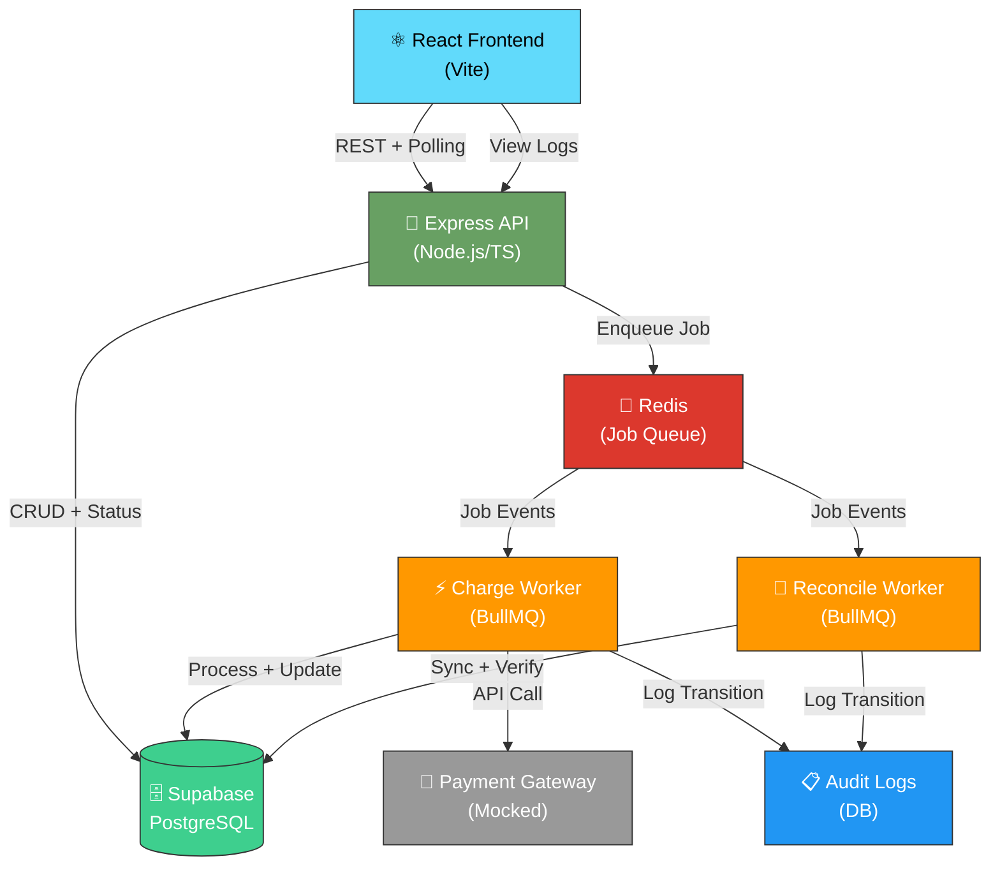
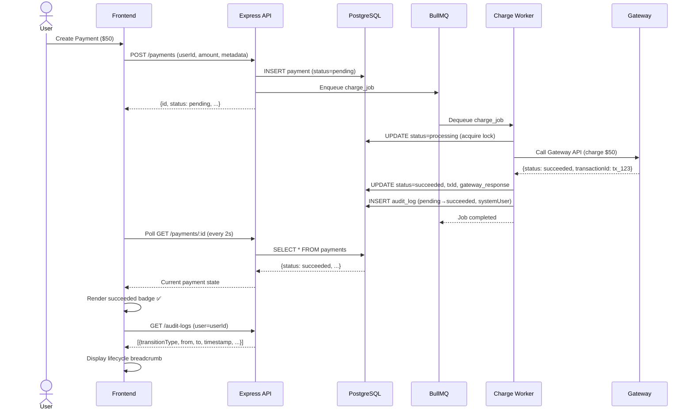

# 💳 PAYEAZIE – Payment Orchestration Platform

A production-grade payment processing system demonstrating modern full-stack architecture, asynchronous job queues, real-time status synchronization, and enterprise-grade authentication with audit logging.

**Built with:** Node.js + Express + TypeScript | React + Vite | PostgreSQL + Supabase | Redis + BullMQ | Render Deployment

---

## 🏗️ High-Level Architecture



**Key Design Choices:**
- **Decoupled Workers:** Charge & reconcile as independent job consumers for fault isolation
- **Redis Queue:** BullMQ provides job persistence, retries, and event-driven architecture
- **Polling Frontend:** React polls `/payments/:id` for real-time lifecycle visibility
- **Audit-First:** Every status transition logged with user, timestamp, and delta

---

## 📊 Payment Lifecycle & Data Flow



**Payment States:**
| State | Trigger | Worker Action |
|-------|---------|---|
| `pending` | API received request | Stored in DB, job enqueued |
| `processing` | Worker acquired job lock | Gateway call in progress |
| `succeeded` | Gateway returned success | Status + transaction ID persisted, audit logged |
| `failed` | Gateway error or timeout | Error persisted, audit logged, no retry by default |

---

## 🎯 Low-Level Design – Component Breakdown

### Backend Layered Architecture

```
┌─────────────────────────────────────────────────────┐
│             ROUTES / CONTROLLERS                     │
│  (/api/routes: payment, auth, audit, health)        │
├─────────────────────────────────────────────────────┤
│             BUSINESS LOGIC LAYER                     │
│  ├─ paymentService (create, fetch, list)           │
│  ├─ authService (login, register, OAuth, reset)    │
│  ├─ statusTransitionService (validate state change) │
│  ├─ auditService (log transitions)                 │
│  └─ rateLimitService (track login attempts)        │
├─────────────────────────────────────────────────────┤
│             WORKER LAYER (Job Consumers)            │
│  ├─ charge.worker (process payment, call gateway)  │
│  ├─ reconcile.worker (sync & verify)               │
│  └─ queue.utils (job enqueueing, events)           │
├─────────────────────────────────────────────────────┤
│             DATA ACCESS LAYER                       │
│  ├─ paymentDB (queries, mutations)                 │
│  ├─ auditDB (insertAuditLog)                       │
│  ├─ userDB (auth, roles)                           │
│  └─ migrations (schema evolution)                  │
├─────────────────────────────────────────────────────┤
│             INFRA LAYER                             │
│  ├─ db.pool (PostgreSQL connection pool)           │
│  ├─ redis.client (BullMQ queue client)             │
│  ├─ logger (structured JSON logging)               │
│  └─ config (env-based settings)                    │
└─────────────────────────────────────────────────────┘

Frontend Components:
┌──────────────────────┐
│   App.tsx (Router)   │
├──────────────────────┤
│  Pages:              │
│  ├─ Dashboard        │
│  ├─ PaymentForm      │
│  ├─ PaymentDetail    │
│  └─ AuditLog         │
├──────────────────────┤
│  Components:         │
│  ├─ StatusBadge      │
│  ├─ PaymentCard      │
│  ├─ LifecycleBread   │
│  └─ AuditTable       │
├──────────────────────┤
│  Context:            │
│  ├─ AuthContext      │
│  └─ PaymentContext   │
├──────────────────────┤
│  Services:           │
│  ├─ paymentService   │
│  ├─ authService      │
│  └─ auditService     │
└──────────────────────┘
```

---

## 🔐 Authentication & Security Architecture

```mermaid
graph LR
    User["👤 User"]
    FE["Frontend"]
    AUTH_API["POST /auth/login<br/>POST /auth/register<br/>POST /auth/google<br/>POST /auth/reset-password"]
    VALIDATE["Validate Input<br/>Rate Limit Check<br/>Hash Password"]
    DB[(PostgreSQL)]
    SESSION["Generate JWT<br/>(exp: 24h)"]
    
    User -->|Email/Pass| FE
    FE -->|Credentials| AUTH_API
    AUTH_API -->|Validate| VALIDATE
    VALIDATE -->|Query User| DB
    DB -->|Return User| SESSION
    SESSION -->|JWT Token| FE
    FE -->|Authorization: Bearer {token}| AUTH_API
    
    AUTH_API -->|Validate JWT| FE
    
    style User fill:#e1f5ff
    style FE fill:#61dafb
    style AUTH_API fill:#68a063
    style VALIDATE fill:#ff9800
    style SESSION fill:#2196f3
    style DB fill:#3ecf8e
```

**Security Features:**
- ✅ **Rate Limiting:** 5 attempts/10min on login (Redis-backed)
- ✅ **Password Reset:** Token-based (expires 30min), sent via email
- ✅ **Google OAuth2:** Passport.js strategy with refresh token handling
- ✅ **JWT Validation:** Middleware on protected routes
- ✅ **Per-User Dashboard:** Users only see their own payments

---

## 🚀 CI/CD Pipeline & Deployment

```mermaid
graph LR
    GH["🔀 GitHub Push<br/>(main branch)"]
    GHA["⚙️ GitHub Actions"]
    TEST["🧪 Run Tests<br/>(Vitest/Jest)"]
    LINT["🔍 ESLint<br/>Prettier"]
    BUILD["🔨 Build Frontend<br/>Compile TS"]
    DOCKER["🐳 Build Docker<br/>Images"]
    RENDER["☁️ Deploy to Render<br/>(Backend API)")
    NETLIFY["🌐 Deploy to Netlify<br/>(Frontend)")
    HEALTH["✅ Health Check<br/>(POST deploy)")
    
    GH -->|Webhook| GHA
    GHA -->|npm test| TEST
    GHA -->|npm run lint| LINT
    TEST -->|Pass| BUILD
    LINT -->|Pass| BUILD
    BUILD -->|Pass| DOCKER
    DOCKER -->|Push| RENDER
    DOCKER -->|Push| NETLIFY
    RENDER -->|Restart API| HEALTH
    NETLIFY -->|Publish Static| HEALTH
    
    style GH fill:#333,color:#fff
    style GHA fill:#4285f4,color:#fff
    style TEST fill:#90ee90
    style DOCKER fill:#2496ed,color:#fff
    style RENDER fill:#46e3b7,color:#000
    style NETLIFY fill:#00c7b7,color:#fff
```

**Pipeline Stages:**
1. **Lint & Test:** ESLint + Prettier (code quality), Vitest/Jest (unit & integration)
2. **Build:** TypeScript compilation, Vite frontend bundle
3. **Docker:** Multi-stage builds for optimized images
4. **Deploy:** Render (backend), Netlify (frontend)
5. **Health Check:** POST-deploy endpoint validation

---

## 📦 Deployment Architecture (Render + Supabase)

```
┌────────────────────────────────────────────────────────────┐
│                      THE INTERNET                          │
└──────────┬────────────────────────┬───────────────────┬────┘
           │                        │                   │
    ┌──────▼─────┐          ┌──────▼──────┐      ┌──────▼────┐
    │  Netlify   │          │   Render    │      │ Supabase  │
    │ (Frontend) │          │  (Backend)  │      │(PostgreSQL│
    │            │          │             │      │ + Redis)  │
    │ React App  │◄────────►│ Node.js API │◄────►│           │
    │ (Static)   │ REST API │ + Workers   │      │ Vector DB │
    │            │          │             │      │ (Auth)    │
    └────────────┘          └─────────────┘      └───────────┘
         │                         │                    │
    Deployed on                 Deployed on          Managed
    CDN (Global)              Web Service           Cloud DB
                              (Auto-scaling)
    
    Frontend:                Backend:                 DB:
    - Vite build            - Fastify server        - PostgreSQL
    - TailwindCSS           - Redis (BullMQ)        - Connection pooling
    - JWT auth header       - Workers (charge,      - Automated backups
    - Polling interval:2s     reconcile)            - Row-level security
```

**Deployment Strategy:**
- **Frontend:** Static site on Netlify CDN (instant updates)
- **Backend:** Docker container on Render with auto-scaling
- **Database:** Managed PostgreSQL on Supabase (no DevOps overhead)
- **Queue:** Redis instance included in Supabase dashboard
- **Environment Separation:** Dev (localhost), Staging (staging env), Prod (main env)

---

## 🛠️ Tech Stack & Trade-offs

| Layer | Technology | Why | Trade-off |
|-------|-----------|-----|-----------|
| **Backend Framework** | Express (Fastify) | Lightweight, middleware-friendly | ~100ms slower than Rust/Go |
| **Language** | Node.js + TypeScript | Type safety + ecosystem | Single-threaded (I/O-bound OK) |
| **Database** | PostgreSQL (Supabase) | ACID + JSON support + managed | NoSQL more scalable for writes |
| **Job Queue** | BullMQ + Redis | Reliable retries + events | Redis memory limits (solved w/ Cluster) |
| **Frontend** | React + Vite | Component reuse + fast build | SPA larger bundle vs SSR |
| **Authentication** | JWT + Passport | Stateless, standard OAuth | Token refresh needed every 24h |
| **Polling** | 2s interval | Real-time feel, minimal latency | WebSocket better for high-frequency |
| **Deployment** | Render + Netlify | Managed, zero DevOps | Higher cost vs bare VPS |

---

## 🐛 Common Bugs & Issues Solved

### ✅ Payment Status Stuck in "Processing"

**Problem:** Worker crashes → job dropped → payment never completes.  
**Solution:** 
- Implement job timeout (30s) → auto-move to failed
- Add dead-letter queue for failed jobs
- Periodic reconciliation worker sweeps stale records

### ✅ Race Condition: Duplicate Charge

**Problem:** Two workers process same payment concurrently.  
**Solution:**
- Database row lock (`SELECT ... FOR UPDATE`) during status transition
- Idempotent gateway calls (transaction ID deduplication)
- Log all transitions with timestamp for audit trail

### ✅ Frontend Polling Creates Stale State

**Problem:** User sees old status, backend updated minutes ago.  
**Solution:**
- Force refresh after payment action (no cache)
- Implement exponential backoff after 10s (reduce polling spam)
- Add "Last Updated" timestamp to response
- Use ETag/If-None-Match for efficient polling

### ✅ Redis Connection Drops in Production

**Problem:** Worker queues freeze, job loss risk.  
**Solution:**
- Redis cluster with Sentinel for failover
- Implement circuit breaker pattern (fallback to sync processing)
- Monitor queue depth & worker lag (Prometheus metrics)
- Auto-reconnect with exponential backoff

### ✅ Gateway Timeout Leaves Payment in Limbo

**Problem:** API timeout → worker unsure if charge succeeded.  
**Solution:**
- Gateway returns transaction ID immediately (not `pending`)
- Worker queries gateway for final status asynchronously
- Reconciliation worker runs every 5min to catch orphaned payments

### ✅ OAuth Token Refresh Expires in Middle of Session

**Problem:** User logged in, token expires, refresh fails.  
**Solution:**
- Refresh token stored in secure HttpOnly cookie (not localStorage)
- Auto-refresh 5min before expiry (background job)
- Graceful redirect to login on 401

### ✅ Audit Logs Don't Match Payment Status

**Problem:** User action logged but payment status unchanged.  
**Solution:**
- Enforce audit log AFTER status transition (transactional)
- Use database triggers for audit on DELETE/UPDATE
- Verify audit log count matches payment state transitions

### ✅ Rate Limiting False Positives (Shared IPs)

**Problem:** Corporate network blocked after 5 failed logins.  
**Solution:**
- Rate limit by username + IP (not just IP)
- Whitelist corporate IPs in `.env`
- Implement CAPTCHA after 3 failures
- Send email notification on suspicious activity

### ✅ Frontend Renders "Unknown" Status

**Problem:** API returns new status type, React crashes.  
**Solution:**
- Frontend has fallback render for unrecognized statuses
- Use status enum validation in TypeScript (strict types)
- Log unexpected statuses to Sentry

### ✅ Worker Processes Job But Doesn't Update DB

**Problem:** Gateway returns success but DB commit fails.  
**Solution:**
- Wrap worker logic in transaction (all-or-nothing)
- Retry mechanism on DB errors (not gateway errors)
- Dead-letter queue for jobs failing >3 times

---

## 📁 Project Structure

```
payeazie/
├── backend/
│   ├── src/
│   │   ├── api/
│   │   │   ├── routes/       (payment, auth, audit)
│   │   │   └── middleware/   (auth, errorHandler)
│   │   ├── core/
│   │   │   ├── services/     (business logic)
│   │   │   └── models/
│   │   ├── db/
│   │   │   ├── index.js      (pool, connection)
│   │   │   └── queries/      (SQL functions)
│   │   ├── workers/
│   │   │   ├── charge.worker.js
│   │   │   └── reconcile.worker.js
│   │   └── utils/
│   │       ├── queue.js      (BullMQ client)
│   │       ├── logger.js     (structured logging)
│   │       └── helpers.js
│   ├── migrations/
│   │   ├── 001_create_payments_table.sql
│   │   ├── 002_create_audit_log.sql
│   │   └── ...
│   ├── server.js            (Express entry point)
│   └── package.json
│
├── frontend/
│   ├── src/
│   │   ├── pages/           (Dashboard, PaymentDetail, etc.)
│   │   ├── components/      (StatusBadge, PaymentCard, etc.)
│   │   ├── context/         (AuthContext, PaymentContext)
│   │   ├── services/        (API calls, auth logic)
│   │   ├── hooks/           (usePayment, useAuth, etc.)
│   │   └── utils/           (formatters, validators)
│   ├── index.tsx
│   └── package.json
│
├── .github/
│   └── workflows/
│       ├── test.yml         (Unit & integration tests)
│       ├── lint.yml         (ESLint, Prettier)
│       └── deploy.yml       (Build & push to Render/Netlify)
│
├── docker-compose.yml       (Local dev: DB, Redis, API, Worker)
├── Dockerfile              (Multi-stage build)
├── README.md               (This file)
└── SYSTEM_PROMPT.md        (Copilot guidelines)
```

---

## 🎮 Quick Start – Local Development

### Prerequisites
```bash
Node.js 18+, PostgreSQL 12+, Redis 6+
```

### Setup

```bash
# Clone & install
git clone https://github.com/yourusername/payeazie.git
cd payeazie

# Backend
cd backend
npm install
cp .env.example .env          # Configure DB & Redis URLs
npm run migrate               # Run migrations
npm run dev                   # Start Express + Workers

# Frontend (new terminal)
cd frontend
npm install
npm run dev                   # Vite dev server (http://localhost:5173)
```

### Verify
```bash
# Health check
curl http://localhost:3000/health

# Create payment
curl -X POST http://localhost:3000/api/payments \
  -H "Content-Type: application/json" \
  -d '{"amount": 50, "description": "Test charge"}'

# Watch worker process it
tail -f backend/logs/app.log
```

---

## 🧪 Testing

```bash
# Unit & integration tests
cd backend && npm test

# E2E payment lifecycle
npm run test:e2e

# Frontend component tests
cd frontend && npm test

# Auth flow (Google OAuth)
npm run test:oauth
```

---

## 📊 Monitoring & Observability

**Logging:** Structured JSON logs (bunyan) shipped to stdout (Render captures).  
**Metrics:** Prometheus client tracking job queue depth, API response time, gateway errors.  
**Alerts:** PagerDuty integration for critical failures (worker dead, queue backed up).  

```bash
# View logs
render logs --tail

# Prometheus metrics endpoint
curl http://localhost:3000/metrics
```

---

## 🤝 Contributing

1. Fork the repo
2. Create feature branch (`git checkout -b feature/my-feature`)
3. Follow SYSTEM_PROMPT.md guidelines
4. Test locally (`npm test`)
5. Push & create PR
6. CI/CD pipeline validates before merge

---

## 📄 License

MIT

---

## 📞 Support

For issues, questions, or feature requests, open a GitHub Issue. For security vulnerabilities, email security@payeazie.dev (if applicable).

---

**Last Updated:** January 2026 | **Status:** Production-Ready ✅
