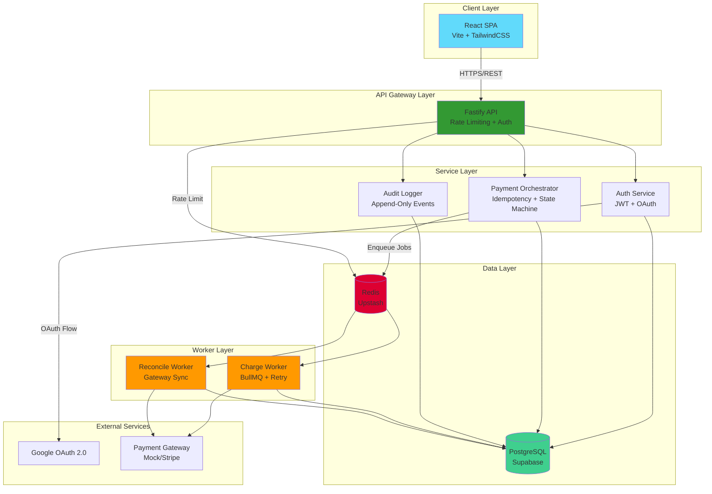
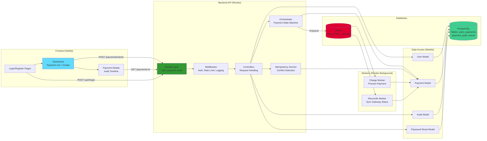
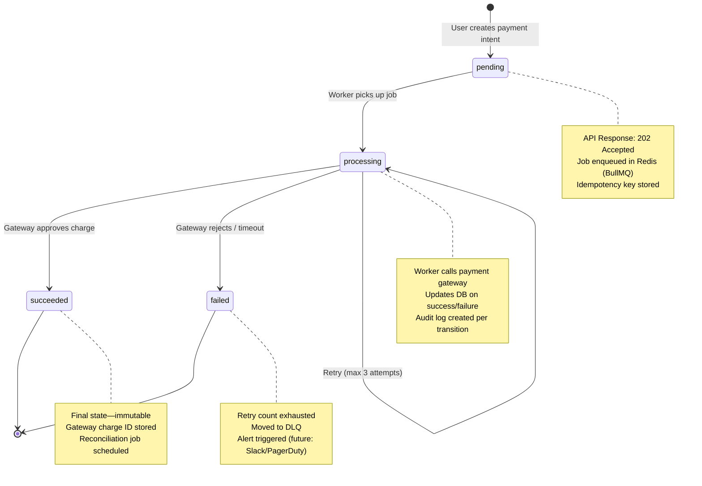
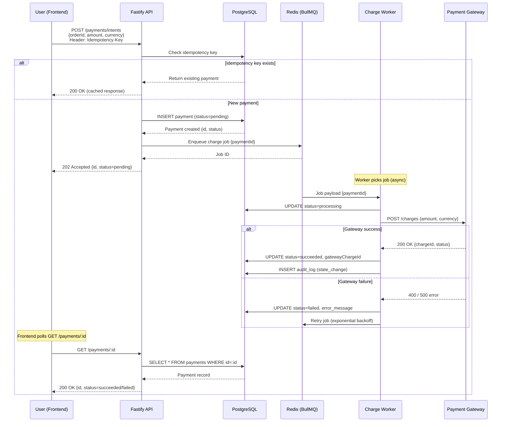
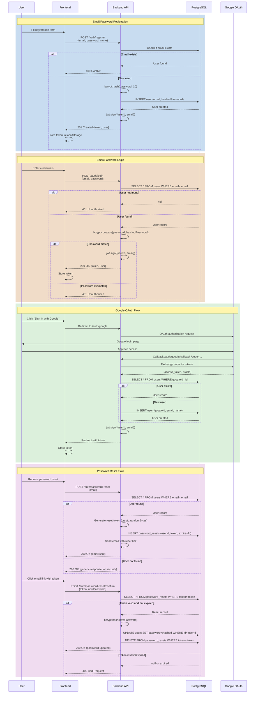
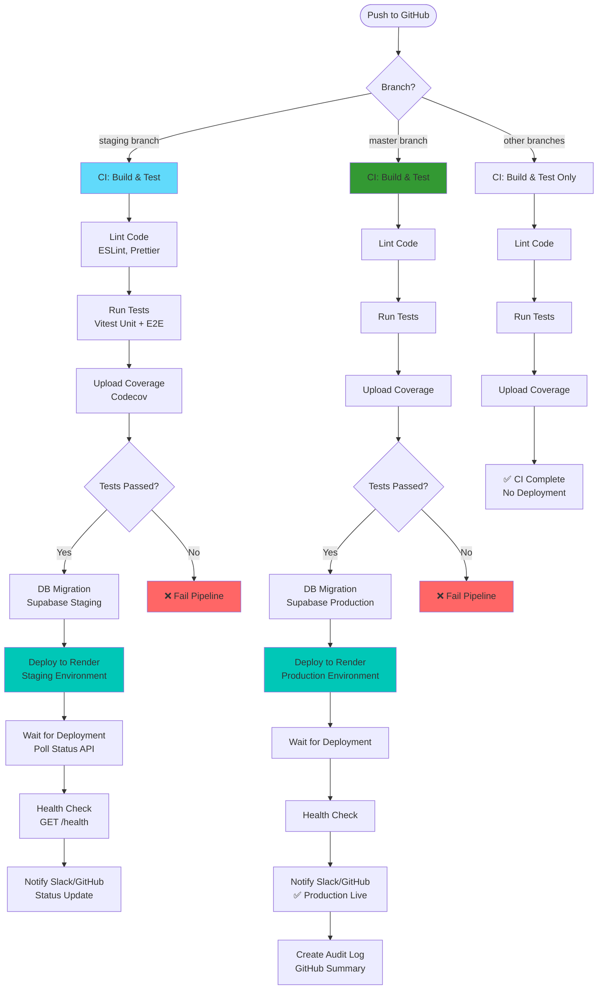
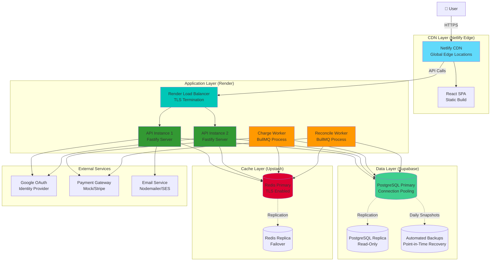

# PAYEAZIE 💳

> **Portfolio-Ready Payment Orchestration Platform** — A production-grade full-stack demo showcasing modern architecture, authentication flows, async processing, and cloud-native deployment.

[](#tech-stack)
[](#tech-stack)
[](#tech-stack)
[](#tech-stack)
[](#tech-stack)
[](#cicd-pipeline)
[](#deployment-architecture)

**🚀 Live Demo**
- **Frontend**: [payeazie.netlify.app](https://payeazie.netlify.app) (Netlify CDN)
- **Backend API**: [payeazie-backend.onrender.com](https://payeazie-backend.onrender.com) (Render)

---

## 📋 Table of Contents
1. [What is PAYEAZIE?](#what-is-payeazie)
2. [Tech Stack](#tech-stack)
3. [Architecture Diagrams](#architecture-diagrams)
   - [High-Level Architecture](#high-level-architecture)
   - [Low-Level Design](#low-level-design)
   - [Layered Architecture](#layered-architecture)
   - [Payment Lifecycle Flow](#payment-lifecycle-flow)
   - [Authentication Flow](#authentication-flow)
   - [Worker Queue Architecture](#worker-queue-architecture)
   - [CI/CD Pipeline](#cicd-pipeline)
   - [Deployment Architecture](#deployment-architecture)
4. [Design Choices & Trade-offs](#design-choices--trade-offs)
5. [Common Issues Solved](#common-issues-solved)
6. [Quick Start](#quick-start)
7. [API Overview](#api-overview)

---

## What is PAYEAZIE?

**PAYEAZIE** is a production-grade payment orchestration platform demonstrating enterprise-level patterns for fintech applications. It combines modern full-stack architecture with real-world authentication, payment processing, audit logging, and cloud deployment strategies.

### 🎯 Key Features
- **🔐 Multi-Strategy Authentication**: Email/password (bcrypt), Google OAuth 2.0, JWT tokens, refresh token rotation, password reset
- **💰 Idempotent Payments**: Payment intent creation with idempotency keys, deterministic state transitions, retry logic
- **📊 Audit & Compliance**: Append-only audit logs, IP/user-agent capture, immutable event sourcing
- **⚡ Async Processing**: BullMQ-backed worker queues for charging & reconciliation, DLQ for failure handling
- **🛡️ Security & Rate Limiting**: 100 req/15min per IP, Redis-backed rate limiter, secure session management
- **📈 Per-User Dashboards**: Real-time payment status polling, transaction history, audit timeline
- **🚀 Cloud-Native Deployment**: Render backend, Netlify frontend, Supabase PostgreSQL, Upstash Redis

### 🎓 Demo Scope
This project is designed to be **portfolio-ready** and **narratable** for technical interviews:
- Showcase **enterprise-ready patterns** (zero-downtime, migrations, observability)
- Provide **end-to-end template** for engineers (frontend, backend, workers, tests)
- Demonstrate **architectural trade-offs** and failure recovery strategies

---

## Tech Stack

| Layer | Technologies | Purpose |
|-------|-------------|---------|
| **Frontend** | React 19, TypeScript, Vite 6, TailwindCSS, React Router | SPA with modern UI/UX, polling-based updates |
| **Backend API** | Node.js 20, Fastify 5, Passport.js, pg-promise, Pino | High-performance REST API with auth & validation |
| **Database** | Supabase PostgreSQL | Users, payments, events, audit logs, password resets |
| **Cache/Queue** | Upstash Redis, BullMQ | Rate limiting, job queues, pub/sub |
| **Workers** | BullMQ (charge/reconcile) | Async payment processing with retry logic |
| **Auth** | Google OAuth 2.0, JWT, bcrypt | Multi-strategy authentication |
| **Gateway** | Mock/Stripe-compatible | Payment gateway simulation |
| **CI/CD** | GitHub Actions | Automated testing, deployment to staging/production |
| **Hosting** | Render (backend), Netlify (frontend) | Serverless & edge deployment |

---

## Architecture Diagrams

### High-Level Architecture



**Design Rationale:**
- **Layered separation**: Frontend polls API, API coordinates services, workers handle async tasks independently
- **Stateless API**: JWT tokens enable horizontal scaling on Render
- **Queue-based decoupling**: Payment creation returns immediately, workers process asynchronously
- **Trade-off**: Real-time updates sacrificed for simplicity (polling instead of WebSockets)

---

### Low-Level Design



**Component Interactions:**
- **Routes → Middleware → Controllers**: Standard MVC pattern with auth/rate-limit checks
- **Orchestrator**: Coordinates payment state transitions, enforces idempotency
- **Models**: Direct database access via `pg-promise`, no ORM for simplicity
- **Workers**: Consume jobs from Redis, update payment status in PostgreSQL

---

### Layered Architecture

```
┌─────────────────────────────────────────────────────────────┐
│                    PRESENTATION LAYER                        │
│  React Components, Pages, Hooks, Context API                │
│  • Login/Register/Dashboard UI                               │
│  • Payment creation forms, detail views                      │
│  • Polling for real-time updates (useEffect + setInterval)  │
└─────────────────────────────────────────────────────────────┘
                            ↓ HTTPS/REST
┌─────────────────────────────────────────────────────────────┐
│                     API/ROUTING LAYER                        │
│  Fastify Routes + Middleware                                 │
│  • /auth/*    (login, register, oauth, password reset)      │
│  • /payments/* (intents, status, list, details)             │
│  • /audit/*   (timeline, events)                            │
│  Middleware: Auth (JWT verify), Rate Limit, Request Logger  │
└─────────────────────────────────────────────────────────────┘
                            ↓
┌─────────────────────────────────────────────────────────────┐
│                   BUSINESS LOGIC LAYER                       │
│  Controllers + Services                                      │
│  • AuthController: bcrypt, JWT issuance, OAuth callback     │
│  • PaymentController: validate, orchestrate, respond        │
│  • AuditController: query logs, format timeline             │
│  Services:                                                   │
│  • PaymentOrchestrator: state machine, idempotency checks   │
│  • IdempotencyService: conflict detection, replay           │
│  • EmailService: password reset, notifications              │
└─────────────────────────────────────────────────────────────┘
                            ↓
┌─────────────────────────────────────────────────────────────┐
│                    DATA ACCESS LAYER                         │
│  Models (pg-promise queries)                                 │
│  • UserModel: CRUD, findByEmail, updatePassword             │
│  • PaymentModel: create, findById, updateStatus             │
│  • AuditModel: insert events, query by paymentId            │
│  • PasswordResetModel: tokens, expiry validation            │
└─────────────────────────────────────────────────────────────┘
                            ↓
┌─────────────────────────────────────────────────────────────┐
│                    PERSISTENCE LAYER                         │
│  Databases + Caches                                          │
│  • PostgreSQL (Supabase): persistent storage                │
│  • Redis (Upstash): rate limiter, BullMQ job store          │
└─────────────────────────────────────────────────────────────┘
                            ↓
┌─────────────────────────────────────────────────────────────┐
│                   BACKGROUND WORKERS                         │
│  BullMQ Workers (separate processes)                         │
│  • Charge Worker: process payment, call gateway, retry      │
│  • Reconcile Worker: sync gateway status, update DB         │
│  • DLQ Monitor: handle failed jobs after max retries        │
└─────────────────────────────────────────────────────────────┘
```

**Why this architecture?**
- **Separation of concerns**: Each layer has a single responsibility
- **Testability**: Layers can be tested independently with mocks
- **Scalability**: Workers can scale separately from API
- **Trade-off**: No event sourcing (ES) for cost reasons—audit logs provide sufficient compliance

---

### Payment Lifecycle Flow



**Sequence Diagram: Payment Creation**



**State Transition Rules:**
1. `pending` → `processing`: Worker starts, exclusively locked via BullMQ
2. `processing` → `succeeded`: Gateway returns 2xx, charge ID captured
3. `processing` → `failed`: Gateway 4xx/5xx after 3 retries, error logged
4. No backward transitions (immutable state machine)

---

### Authentication Flow



**Auth Middleware:**
```javascript
// Simplified auth.middleware.js
function authenticate(req, res, next) {
  const token = req.headers.authorization?.split(' ')[1];
  if (!token) return res.status(401).send({ error: 'Unauthorized' });
  
  try {
    const decoded = jwt.verify(token, process.env.JWT_SECRET);
    req.user = decoded; // Attach user to request
    next();
  } catch (err) {
    res.status(401).send({ error: 'Invalid token' });
  }
}
```

**Security Features:**
- **Rate limiting**: 100 requests/15min per IP (Redis-backed)
- **Bcrypt**: 10 salt rounds for password hashing
- **JWT**: HS256 algorithm, 7-day expiry, refresh token rotation (future)
- **HTTPS**: All API calls over TLS (Render enforces HTTPS)
- **CORS**: Whitelist frontend origin (Netlify domain)

---

### Worker Queue Architecture

```mermaid
graph TB
    subgraph "API Process (Render Web Service)"
        API[Fastify API]
        QUEUE_CLIENT[BullMQ Queue Client<br/>Enqueue Jobs]
        API --> QUEUE_CLIENT
    end
    
    subgraph "Redis (Upstash)"
        CHARGE_Q[Charge Queue<br/>charge:jobs]
        RECON_Q[Reconcile Queue<br/>reconcile:jobs]
        DLQ[Dead Letter Queue<br/>failed:jobs]
    end
    
    subgraph "Worker Process 1 (Render Background)"
        CW1[Charge Worker<br/>Concurrency: 5]
        CW1_PROC[Process Job:<br/>1. Call Gateway<br/>2. Update DB<br/>3. Log Audit]
        CW1 --> CW1_PROC
    end
    
    subgraph "Worker Process 2 (Render Background)"
        RW1[Reconcile Worker<br/>Concurrency: 3]
        RW1_PROC[Process Job:<br/>1. Fetch Gateway Status<br/>2. Sync to DB<br/>3. Schedule Next Check]
        RW1 --> RW1_PROC
    end
    
    subgraph "External Services"
        GATEWAY[Payment Gateway]
        DB[(PostgreSQL)]
    end
    
    QUEUE_CLIENT -->|Enqueue| CHARGE_Q
    QUEUE_CLIENT -->|Enqueue| RECON_Q
    CHARGE_Q -->|Poll| CW1
    RECON_Q -->|Poll| RW1
    
    CW1_PROC -->|POST /charges| GATEWAY
    RW1_PROC -->|GET /charges/:id| GATEWAY
    CW1_PROC -->|UPDATE payments| DB
    RW1_PROC -->|UPDATE payments| DB
    
    CW1 -.->|Failed (3 retries)| DLQ
    RW1 -.->|Failed (3 retries)| DLQ
    
    style CHARGE_Q fill:#dd0031
    style RECON_Q fill:#dd0031
    style DLQ fill:#ff6666
    style CW1 fill:#ff9900
    style RW1 fill:#ff9900
```

**Worker Configuration:**

| Worker | Queue | Concurrency | Retry Strategy | Purpose |
|--------|-------|-------------|----------------|---------|
| **Charge** | `charge:jobs` | 5 workers | 3 retries, exponential backoff (1s, 5s, 15s) | Process payment via gateway |
| **Reconcile** | `reconcile:jobs` | 3 workers | 5 retries, fixed delay (30s) | Sync gateway status periodically |

**Job Lifecycle:**
1. API enqueues job with `{paymentId}` payload
2. Worker picks job (FIFO, LIFO, or priority-based)
3. Worker executes logic (gateway call, DB update)
4. On failure: job moves to "retry" with backoff delay
5. After max retries: job moves to DLQ for manual intervention

**Trade-offs:**
- ✅ **Decoupled processing**: API returns immediately, workers handle async
- ✅ **Retry resilience**: Temporary gateway failures auto-recover
- ✅ **Horizontal scaling**: Add more worker dynos on Render
- ❌ **No real-time updates**: Frontend polls instead of push (simplicity > complexity)
- ❌ **Single Redis instance**: No Redis Cluster for cost (Upstash free tier)

---

### CI/CD Pipeline



**Pipeline Stages (GitHub Actions):**

1. **CI (All Branches)**
   - Checkout code
   - Install dependencies (`npm ci`)
   - Lint code (ESLint, Prettier)
   - Run tests (`npm test`)
   - Upload coverage to Codecov

2. **CD (Staging Branch)**
   - Run database migrations (Supabase staging)
   - Trigger Render deployment via API
   - Poll deployment status (max 10 min timeout)
   - Health check (`curl /health`)
   - Notify team (Slack webhook)

3. **CD (Master Branch)**
   - Same as staging, but targets production environment
   - Additional audit log in GitHub Actions summary
   - Requires manual approval (GitHub Environments)

**Key Configuration (`.github/workflows/backend-ci-cd.yml`):**
```yaml
jobs:
  ci:
    runs-on: ubuntu-latest
    steps:
      - uses: actions/checkout@v4
      - uses: actions/setup-node@v4
      - run: npm ci
      - run: npm test
      - uses: codecov/codecov-action@v3
  
  deploy-production:
    needs: ci
    if: github.ref == 'refs/heads/master'
    environment: production
    steps:
      - run: node scripts/migrate.js
      - run: curl -X POST https://api.render.com/v1/services/${{ secrets.RENDER_SERVICE_ID }}/deploys
      - run: curl https://payeazie.onrender.com/health
```

**Deployment Environments:**
- **Staging**: Auto-deploy on `staging` branch push
- **Production**: Auto-deploy on `master` branch push (with manual approval)

---

### Deployment Architecture



**Infrastructure Components:**

| Component | Service | Configuration | Cost (Est.) |
|-----------|---------|---------------|-------------|
| **Frontend Hosting** | Netlify | Free tier, global CDN, auto-deploy from `master` | $0/month |
| **Backend API** | Render Web Service | 512MB RAM, auto-scale 1-2 instances | $7-14/month |
| **Background Workers** | Render Background Worker | 512MB RAM, 1 instance per worker type | $14/month |
| **Database** | Supabase PostgreSQL | Free tier: 500MB DB, 2GB transfer | $0/month (scales to $25) |
| **Cache/Queue** | Upstash Redis | Free tier: 10K commands/day | $0/month (scales to $10) |
| **Total** | — | — | **~$21-28/month** |

**Networking & Security:**
- **TLS**: Enforced on all layers (Netlify, Render auto-provision Let's Encrypt)
- **CORS**: Whitelist Netlify domain in Fastify config
- **Environment Variables**: Stored in Render/Netlify dashboards (encrypted at rest)
- **Rate Limiting**: Redis-backed, 100 req/15min per IP
- **Database Connection**: Pooling via `pg-promise` (max 20 connections)

**High Availability:**
- **Render**: Auto-restart on crash, rolling deploys (zero downtime)
- **Supabase**: Daily backups, point-in-time recovery, read replicas
- **Upstash**: Automatic failover to replica, 99.9% SLA
- **Monitoring**: Render metrics (CPU, memory), Supabase dashboard, Upstash logs

---

## Design Choices & Trade-offs

### 1. **Polling vs. WebSockets**
- **Choice**: Frontend polls `/payments/:id` every 2 seconds
- **Why**: Simplicity, no WebSocket server needed, lower cost
- **Trade-off**: Higher latency (~2s delay), more API calls

### 2. **No ORM (Direct SQL via pg-promise)**
- **Choice**: Write raw SQL queries
- **Why**: Performance, full control, no impedance mismatch
- **Trade-off**: Verbose code, manual migration management

### 3. **BullMQ Instead of Kafka**
- **Choice**: Redis-backed job queue
- **Why**: Lightweight, built-in retry logic, easier local dev
- **Trade-off**: Not suited for event streaming, single point of failure (Redis)

### 4. **JWT Tokens (No Session Store)**
- **Choice**: Stateless authentication
- **Why**: Horizontal scaling, no Redis session store needed
- **Trade-off**: Cannot revoke tokens (workaround: short expiry + refresh tokens)

### 5. **Mock Payment Gateway**
- **Choice**: Simulate Stripe API locally
- **Why**: No Stripe account needed, instant testing
- **Trade-off**: Not production-ready (easy to swap for real Stripe SDK)

### 6. **Monorepo Structure**
- **Choice**: `/backend` and `/frontend` in same repo
- **Why**: Easier PR reviews, shared CI/CD, simpler for solo dev
- **Trade-off**: Larger repo, mixed concerns (acceptable for demo)

### 7. **No Kubernetes**
- **Choice**: Deploy to Render (PaaS)
- **Why**: Lower complexity, faster iteration, no cluster management
- **Trade-off**: Less control over infrastructure, vendor lock-in

### 8. **Append-Only Audit Logs**
- **Choice**: Immutable event log for all state changes
- **Why**: Compliance, debugging, replay capability
- **Trade-off**: Storage grows indefinitely (future: archive to S3)

---

## Common Issues Solved

### 🐛 Authentication & Security
- **CORS errors on OAuth callback**: Whitelist exact redirect URI in Google Console + Fastify CORS config
- **JWT tokens not persisting**: Store in `localStorage` (not `sessionStorage`), check expiry on every request
- **Rate limit false positives**: Use IP from `X-Forwarded-For` header (Render proxy), not `req.ip`
- **Password reset tokens expiring**: Set 1-hour expiry, validate `expiresAt` in DB query

### 🐛 Payment Processing
- **Idempotency key conflicts**: Return cached response (200) instead of creating duplicate, check payload hash
- **Worker job stalls**: Set job timeout (30s), enable BullMQ stalled job recovery, monitor DLQ
- **Race condition on status updates**: Use DB transactions (`BEGIN...COMMIT`), lock rows with `FOR UPDATE`
- **Gateway timeout handling**: Retry with exponential backoff (1s, 5s, 15s), log all gateway responses

### 🐛 Database & Performance
- **Connection pool exhaustion**: Set `max: 20` in `pg-promise`, close idle connections after 30s
- **Slow audit log queries**: Index `payment_id` and `created_at`, paginate results
- **N+1 query problem**: Batch load related records with `JOIN`, avoid loops in controllers
- **Migration conflicts**: Use sequential migration numbers, test rollback locally

### 🐛 Deployment & DevOps
- **Render cold starts**: Keep 1 API instance always warm (ping `/health` every 5 min via cron job)
- **Environment variable leaks**: Use Render's secret manager, never commit `.env` to Git
- **Build failures on Render**: Lock Node version (20.x), use `npm ci` instead of `npm install`
- **Worker not processing jobs**: Verify Redis connection, check Render logs, restart worker dyno

### 🐛 Frontend Issues
- **Polling causing memory leaks**: Clear `setInterval` in `useEffect` cleanup function
- **Stale payment status**: Invalidate cache on mutation (use TanStack Query's `invalidateQueries`)
- **React 19 strict mode double renders**: Handle idempotent effects, use `useRef` for mount tracking
- **Tailwind styles not applying**: Rebuild CSS bundle, check Vite config paths, clear browser cache

---

## Quick Start

### Prerequisites
- Node.js 20+
- PostgreSQL (or Supabase account)
- Redis (or Upstash account)
- Google OAuth credentials (optional)

### Local Development

```bash
# Clone repository
git clone https://github.com/techmedaddy/payeazie.git
cd payeazie

# Backend setup
cd backend
cp .env.example .env
# Edit .env with your database/Redis credentials
npm install
npm run db:setup  # Initialize DB schema
npm start         # Start API on http://localhost:3001

# Worker setup (in separate terminal)
node src/workers/charge.worker.js
node src/workers/reconcile.worker.js

# Frontend setup (in separate terminal)
cd ../frontend
cp .env .env.local
# Edit .env.local with API URL
npm install
npm run dev       # Start React app on http://localhost:5173
```

### Running Tests

```bash
# Backend tests
cd backend
npm test
npm run test:coverage

# Frontend tests
cd frontend
npm test
npm run test:ui
```

### Deployment

```bash
# Deploy frontend to Netlify
cd frontend
npm run build
netlify deploy --prod

# Deploy backend to Render
# Push to GitHub `master` branch → auto-deploys via CI/CD
git push origin master
```

---

## API Overview

### Authentication Endpoints
| Method | Endpoint | Description |
|--------|----------|-------------|
| `POST` | `/auth/register` | Create new user (email/password) |
| `POST` | `/auth/login` | Login with email/password |
| `GET` | `/auth/google` | Initiate Google OAuth flow |
| `GET` | `/auth/google/callback` | OAuth callback handler |
| `POST` | `/auth/password-reset` | Request password reset email |
| `POST` | `/auth/password-reset/confirm` | Confirm reset with token |

### Payment Endpoints
| Method | Endpoint | Description |
|--------|----------|-------------|
| `POST` | `/api/payments/intents` | Create payment intent (idempotent) |
| `GET` | `/api/payments/:id` | Get payment details |
| `GET` | `/api/payments` | List user's payments (paginated) |
| `GET` | `/api/payments/:id/audit` | Get audit timeline |

### Health Check
| Method | Endpoint | Description |
|--------|----------|-------------|
| `GET` | `/health` | API health status (DB, Redis, workers) |

**Example: Create Payment Intent**
```bash
curl -X POST https://payeazie-backend.onrender.com/api/payments/intents \
  -H "Content-Type: application/json" \
  -H "Idempotency-Key: $(uuidgen)" \
  -H "Authorization: Bearer <JWT_TOKEN>" \
  -d '{
    "orderId": "ORD-12345",
    "amount": 99.99,
    "currency": "USD"
  }'
```

**Response:**
```json
{
  "id": "550e8400-e29b-41d4-a716-446655440000",
  "orderId": "ORD-12345",
  "status": "pending",
  "amount": 99.99,
  "currency": "USD",
  "createdAt": "2026-01-13T10:00:00.000Z"
}
```

---

## 📜 License
MIT License - see [LICENSE](LICENSE) for details.

---

## 🤝 Contributing
This is a portfolio/demo project. Feel free to fork and adapt for your own use!

---

## 📧 Contact
Built by **[Your Name]** | [GitHub](https://github.com/techmedaddy) | [LinkedIn](#)

---

**⭐ Star this repo if it helped you learn full-stack architecture!**
