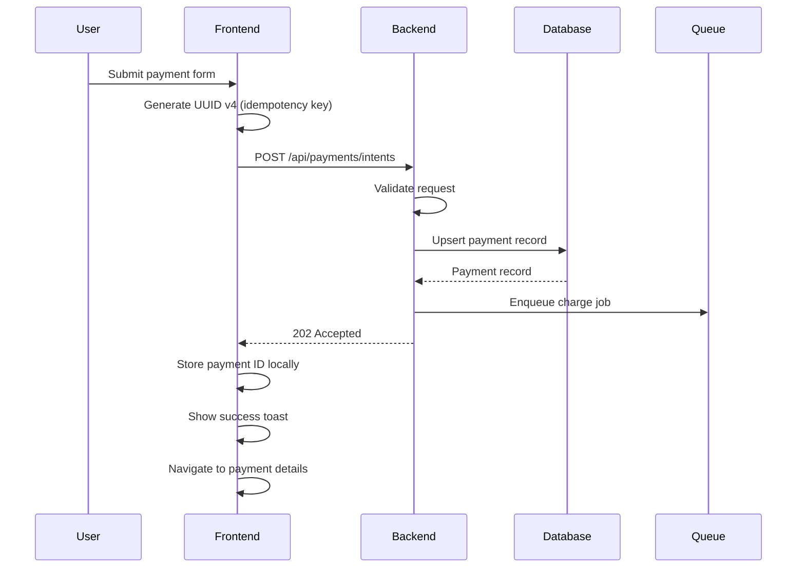
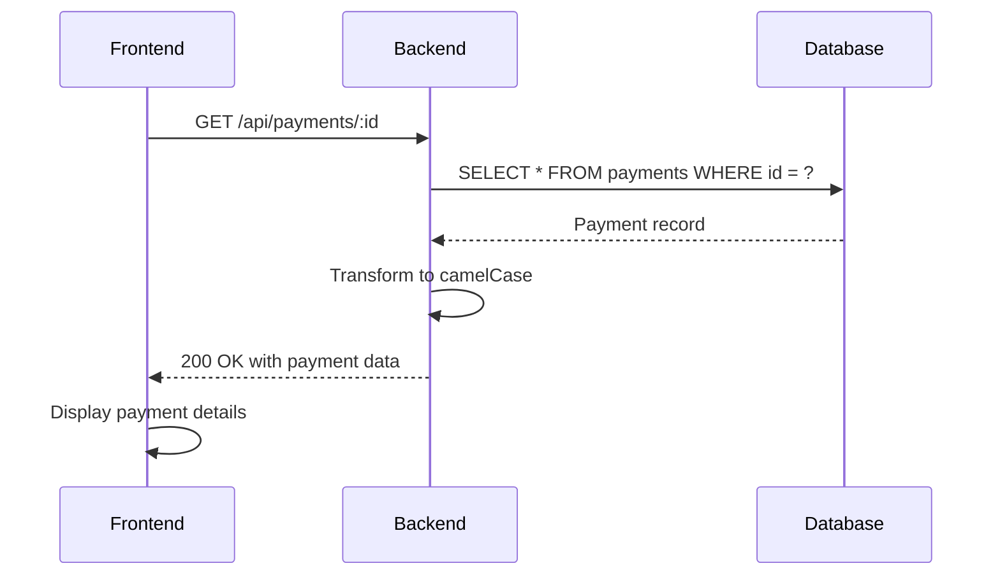

# Payment Flow - Complete API Endpoints

## Overview

This document describes the complete payment flow from frontend to backend after all fixes have been applied.

## API Endpoints

### 1. Create Payment Intent

**Endpoint**: `POST /api/payments/intents`

**Request Headers**:
```
Content-Type: application/json
Idempotency-Key: <uuid-v4>
```

**Request Body**:
```json
{
  "orderId": "ORD-1234",
  "amount": 99.99,
  "currency": "USD"
}
```

**Response** (HTTP 200/202):
```json
{
  "id": "550e8400-e29b-41d4-a716-446655440000",
  "orderId": "ORD-1234",
  "idempotencyKey": "123e4567-e89b-12d3-a456-426614174000",
  "amount": 99.99,
  "currency": "USD",
  "status": "processing",
  "gatewayChargeId": null,
  "createdAt": "2026-01-07T10:30:00.000Z",
  "updatedAt": "2026-01-07T10:30:00.000Z"
}
```

**Status Codes**:
- `200 OK`: Payment intent already exists (idempotent response)
- `202 Accepted`: New payment intent created and being processed
- `400 Bad Request`: Missing required fields
- `409 Conflict`: Idempotency key reused with different payload
- `500 Internal Server Error`: Server error

### 2. Get Payment by ID

**Endpoint**: `GET /api/payments/:id`

**Request Headers**: None required

**Response** (HTTP 200):
```json
{
  "id": "550e8400-e29b-41d4-a716-446655440000",
  "orderId": "ORD-1234",
  "idempotencyKey": "123e4567-e89b-12d3-a456-426614174000",
  "amount": 99.99,
  "currency": "USD",
  "status": "processing",
  "gatewayChargeId": null,
  "createdAt": "2026-01-07T10:30:00.000Z",
  "updatedAt": "2026-01-07T10:30:00.000Z"
}
```

**Status Codes**:
- `200 OK`: Payment found
- `400 Bad Request`: Missing payment ID
- `404 Not Found`: Payment not found
- `500 Internal Server Error`: Server error

## Frontend to Backend Flow

### 1. User Creates Payment



### 2. Frontend Fetches Payment Details



## Data Transformation

### Database Schema (snake_case)
```sql
CREATE TABLE payments (
    id UUID PRIMARY KEY,
    order_id TEXT NOT NULL,
    idempotency_key UUID NOT NULL,
    amount BIGINT NOT NULL,
    currency VARCHAR(3) NOT NULL,
    status VARCHAR(20) NOT NULL DEFAULT 'processing',
    gateway_charge_id TEXT,
    created_at TIMESTAMPTZ DEFAULT NOW(),
    updated_at TIMESTAMPTZ DEFAULT NOW()
);
```

### API Response (camelCase)
The backend transforms database records to camelCase before sending:
- `order_id` → `orderId`
- `idempotency_key` → `idempotencyKey`
- `gateway_charge_id` → `gatewayChargeId`
- `created_at` → `createdAt`
- `updated_at` → `updatedAt`

## Idempotency

The backend implements idempotency using:

1. **Unique Constraint**: `(order_id, idempotency_key)` ensures no duplicates
2. **Upsert Logic**: Returns existing record if found, creates new if not
3. **Payload Validation**: Rejects requests with same key but different payload

Example:
```javascript
// First request - creates payment
POST /api/payments/intents
Idempotency-Key: abc-123
Body: { orderId: "ORD-1", amount: 100, currency: "USD" }
→ 202 Accepted (new payment created)

// Duplicate request - returns same payment
POST /api/payments/intents
Idempotency-Key: abc-123
Body: { orderId: "ORD-1", amount: 100, currency: "USD" }
→ 200 OK (existing payment returned)

// Conflicting request - rejected
POST /api/payments/intents
Idempotency-Key: abc-123
Body: { orderId: "ORD-1", amount: 200, currency: "USD" }  // Different amount!
→ 409 Conflict (payload mismatch)
```

## Error Handling

### Frontend Error Display
```typescript
try {
  const response = await PaymentService.createPaymentIntent(data, key);
  showToast('Payment intent created successfully', 'success');
} catch (error: any) {
  showToast(error.message || 'Failed to create payment', 'error');
  setResponseDebug(JSON.stringify(error, null, 2));
}
```

### Backend Error Logging
All errors are logged with full context:
```javascript
logger.error({
  error: err.message,
  stack: err.stack,
  name: err.name,
  orderId,
  idempotencyKey
}, 'createPaymentIntent: error caught');
```

## Testing

Run the comprehensive test script:
```bash
cd backend
./scripts/test-payment-api.sh
```

This tests:
1. ✅ Backend health check
2. ✅ Payment creation (POST)
3. ✅ Response structure (camelCase fields)
4. ✅ Payment retrieval (GET)
5. ✅ Idempotency (duplicate requests)

## Payment Status Lifecycle

```
processing → authorized → captured → succeeded
     ↓            ↓           ↓
   failed ← ← ← ← ← ← ← ← ← ← refunded
```

Allowed transitions are enforced by the payment orchestrator.
